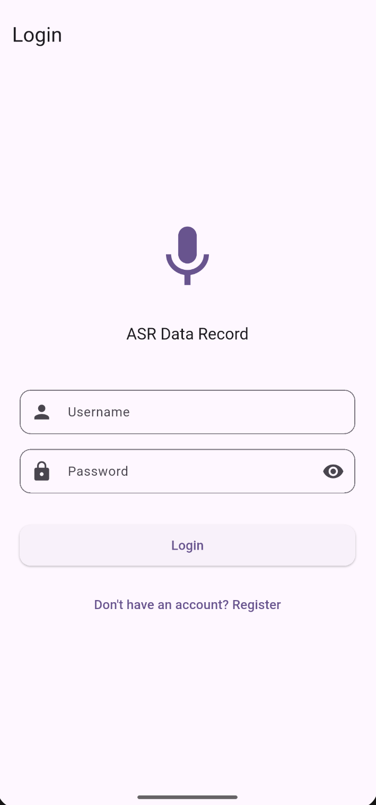
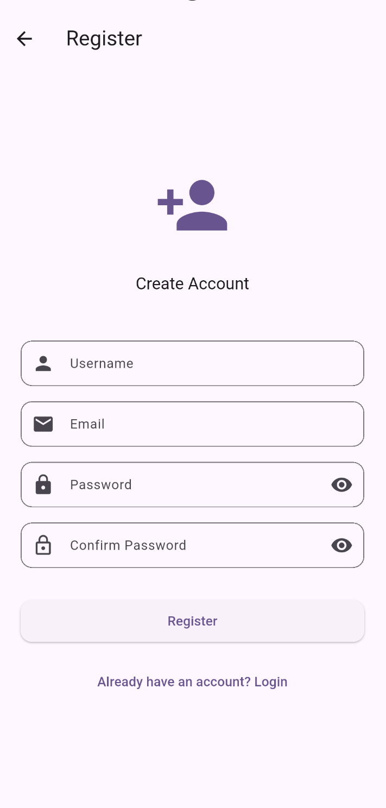
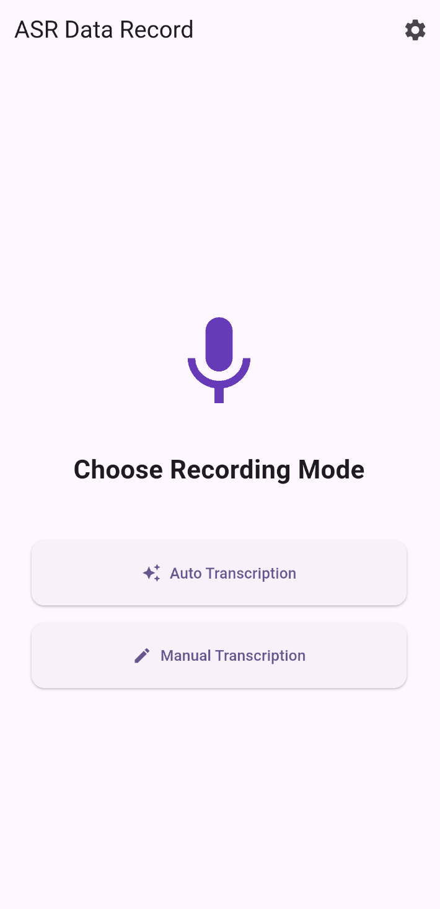
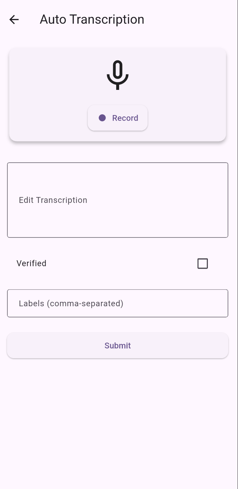
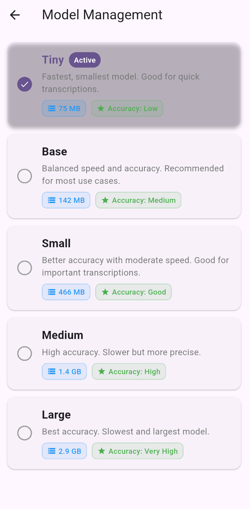
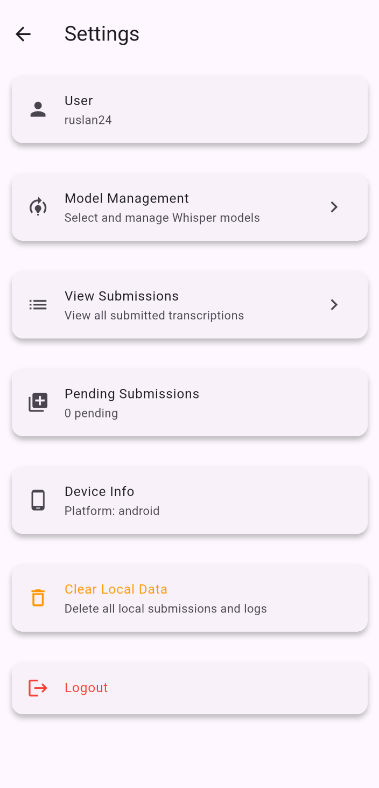
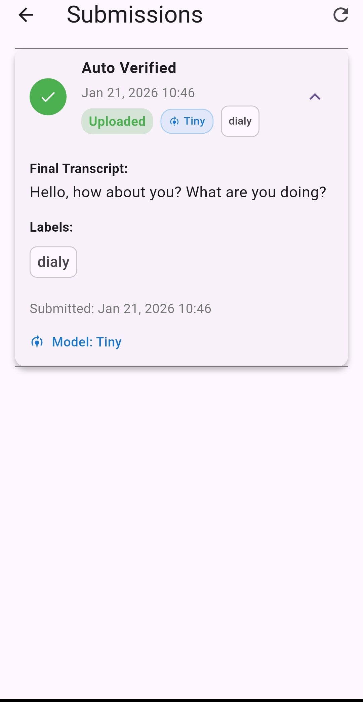

# ASR Data Record

A Flutter app for recording and transcribing audio using on-device speech recognition. Built with whisper.cpp integration, so everything runs locally without needing an internet connection.

## What it does

The app lets you record audio and get transcriptions in two ways:
- **Auto transcription**: Record audio, let the app transcribe it automatically using ASR, then edit and submit
- **Manual transcription**: Record audio and type out the transcription yourself

There's also user authentication, offline support (submissions queue up when you're offline), and a customizable theme system.

## Screenshots

### Login Screen
The login screen features a clean interface with a prominent microphone icon, username and password fields, and options to login or navigate to registration.



### Register Screen
Create a new account with username, email, and password fields. Includes password confirmation and validation.



### Home Screen
The main screen lets you choose between auto or manual transcription modes. Features a large microphone icon and two clear action buttons.



### Auto Transcription Screen
Record audio and get automatic transcriptions. Edit the generated text, add labels, mark as verified, and submit your transcription.



### Model Management Screen
Select from different Whisper models (Tiny, Base, Small, Medium, Large) with details about size, speed, and accuracy trade-offs.



### Settings Screen
Manage your account, view submissions, check pending uploads, and access device information. Includes options to clear local data and logout.



### Submissions Screen
View all your submitted transcriptions with status indicators, verification badges, model information, and full transcript details.



## Setup

You'll need Flutter 3.5.1 or higher. After cloning, run:

```bash
flutter pub get
flutter run
```

That's pretty much it. The app uses a mock backend for development (just JSON files), so you don't need to set up any server.

## Project structure

The code is organized into:
- `lib/config/` - UI theme configuration
- `lib/models/` - Data models
- `lib/providers/` - Riverpod state management
- `lib/screens/` - All the UI screens
- `lib/services/` - Business logic (auth, recording, ASR, submissions)
- `lib/utils/` - Helper utilities

## Configuration

You can customize the UI theme by editing `assets/config/ui_config.json`. The options are pretty self-explanatory - style, density, contrast, and shape settings.

## Mock backend

For development, there's a mock backend that uses JSON files in `assets/mock_backend/`. It simulates a real API but just reads/writes to local files. There's a test user already set up:
- Username: `testuser`
- Password: `testpass123`

## Building

For Android:
```bash
flutter build apk --release
```

For iOS, you'll need Xcode and to configure signing. Note that whisper.cpp integration for iOS isn't fully done yet.

## Current status

Most features are working:
- User auth (register/login/logout)
- Audio recording with permissions
- Auto transcription screen (ASR is integrated via whisper_flutter_new)
- Manual transcription screen
- Submission creation and upload
- Offline queue with retry
- Theme customization
- Settings screen

The ASR integration uses whisper.cpp through the `whisper_flutter_new` package. It's working but you might need to download models separately depending on your setup.

## Tech stack

- **State management**: Riverpod
- **Navigation**: GoRouter
- **Audio recording**: record package
- **ASR**: whisper_flutter_new (whisper.cpp wrapper)
- **Storage**: flutter_secure_storage for tokens, shared_preferences for settings
- **HTTP**: dio/http for future backend integration

## Testing

Run tests with:
```bash
flutter test
```

There are some basic tests for models and services, plus an integration test for the submission flow.

## Notes

The app is designed to work offline-first. Submissions get queued locally if you're not online, and they'll retry automatically when connectivity is restored.

If you run into issues with whisper.cpp, make sure you have the native libraries set up correctly for your platform. Android should work out of the box, but iOS might need some additional setup.
